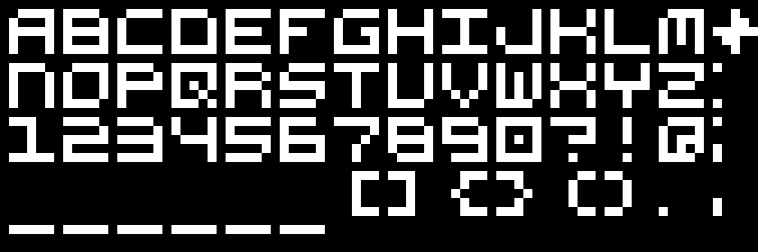

# Pixel font

5x5 Pixel font for Flipdot displays


and a 3x3 Pixel font for very small displays


## Usage
These fonts are made in JavaScript and every character is represented as an array of 0s and 1s.
Example:
```js
const characters = {
      "A": [
        [0,1,1,1,1],
        [1,0,0,0,1],
        [1,1,1,1,1],
        [1,0,0,0,1],
        [1,0,0,0,1],
    ],
    etc...
```
Big letters are located in `js/font.js` and small letters in `js/font-small.js`.

### Special characters (5x5)
To place special characters which save space, you can use these single-character representations:
- Question + Exclamation in one character: "~"
- 'IJ' in one character: "^"

## Testing and Demo
You can test and demo the fonts in your browser by opening `index.html`. This allows you to test out characters in the two different fonts and with a few animations.
Clone the repo and open a live server to test it out.

## License
This project is licensed under the Creative Commons Attribution 4.0 International (CC BY 4.0).
In short this means you are free to share and adapt the material for any purpose, even commercially, as long as you give appropriate credit to me.

Full license text: https://creativecommons.org/licenses/by/4.0/

## Every letter
### 5x5 Font
```
const characters = {
      "A": [
        [0,1,1,1,1],
        [1,0,0,0,1],
        [1,1,1,1,1],
        [1,0,0,0,1],
        [1,0,0,0,1],
    ],
    "B": [
        [1,1,1,1,0],
        [1,0,0,0,1],
        [1,1,1,1,1],
        [1,0,0,0,1],
        [1,1,1,1,1],
    ],
    "C": [
        [0,1,1,1,1],
        [1,0,0,0,0],
        [1,0,0,0,0],
        [1,0,0,0,0],
        [1,1,1,1,1],
    ],
    "D": [
        [1,1,1,1,0],
        [1,0,0,0,1],
        [1,0,0,0,1],
        [1,0,0,0,1],
        [1,1,1,1,1],
    ],
    "E": [
        [1,1,1,1,1],
        [1,0,0,0,0],
        [1,1,1,1,0],
        [1,0,0,0,0],
        [1,1,1,1,1],
    ],
    "F": [
        [1,1,1,1,1],
        [1,0,0,0,0],
        [1,1,1,0,0],
        [1,0,0,0,0],
        [1,0,0,0,0],
    ],
    "G": [
        [0,1,1,1,1],
        [1,0,0,0,0],
        [1,0,0,1,1],
        [1,0,0,0,1],
        [1,1,1,1,1],
    ],
    "H": [
        [1,0,0,0,1],
        [1,0,0,0,1],
        [1,1,1,1,1],
        [1,0,0,0,1],
        [1,0,0,0,1],
    ],
    "I": [
        [1,1,1,1,1],
        [0,0,1,0,0],
        [0,0,1,0,0],
        [0,0,1,0,0],
        [1,1,1,1,1],
    ],
    "J": [
        [0,0,0,0,1],
        [0,0,0,0,1],
        [1,0,0,0,1],
        [1,0,0,0,1],
        [0,1,1,1,1],
    ],
    "K": [
        [1,0,0,0,1],
        [1,0,0,0,1],
        [1,1,1,1,0],
        [1,0,0,0,1],
        [1,0,0,0,1],
    ],
    "L": [
        [1,0,0,0,0],
        [1,0,0,0,0],
        [1,0,0,0,0],
        [1,0,0,0,0],
        [1,1,1,1,1],
    ],
    "M": [
        [0,1,1,1,1],
        [1,0,1,0,1],
        [1,0,1,0,1],
        [1,0,1,0,1],
        [1,0,0,0,1],
    ],
    "N": [
        [1,1,1,1,0],
        [1,0,0,0,1],
        [1,0,0,0,1],
        [1,0,0,0,1],
        [1,0,0,0,1],
    ],
    "O": [
        [0,1,1,1,1],
        [1,0,0,0,1],
        [1,0,0,0,1],
        [1,0,0,0,1],
        [1,1,1,1,0],
    ],
    "P": [
        [1,1,1,1,0],
        [1,0,0,0,1],
        [1,1,1,1,1],
        [1,0,0,0,0],
        [1,0,0,0,0],
    ],
    "Q": [
        [1,1,1,1,1],
        [1,0,0,0,1],
        [1,0,1,0,1],
        [1,0,0,1,0],
        [1,1,1,0,1],
    ],
    "R": [
        [1,1,1,1,0],
        [1,0,0,0,1],
        [1,1,1,1,0],
        [1,0,0,0,1],
        [1,0,0,0,1],
    ],
    "S": [
        [0,1,1,1,1],
        [1,0,0,0,0],
        [1,1,1,1,1],
        [0,0,0,0,1],
        [1,1,1,1,0],
    ],
    "T": [
        [1,1,1,1,1],
        [0,0,1,0,0],
        [0,0,1,0,0],
        [0,0,1,0,0],
        [0,0,1,0,0],
    ],
    "U": [
        [1,0,0,0,1],
        [1,0,0,0,1],
        [1,0,0,0,1],
        [1,0,0,0,1],
        [1,1,1,1,0],
    ],
    "V": [
        [1,0,0,0,1],
        [1,0,0,0,1],
        [1,0,0,0,1],
        [0,1,0,1,0],
        [0,0,1,0,0],
    ],
    "W": [
        [1,0,0,0,1],
        [1,0,1,0,1],
        [1,0,1,0,1],
        [1,0,1,0,1],
        [1,1,1,1,0],
    ],
    "X": [
        [1,0,0,0,1],
        [1,0,0,0,1],
        [0,1,1,1,0],
        [1,0,0,0,1],
        [1,0,0,0,1],
    ],
    "Y": [
        [1,0,0,0,1],
        [1,0,0,0,1],
        [1,1,1,1,1],
        [0,0,1,0,0],
        [0,0,1,0,0],
    ],
    "Z": [
        [1,1,1,1,1],
        [0,0,0,0,1],
        [0,1,1,1,0],
        [1,0,0,0,0],
        [1,1,1,1,1],
    ],
    "?": [
        [1,1,1,1,1],
        [0,0,0,0,1],
        [0,0,1,1,1],
        [0,0,0,0,0],
        [0,0,1,0,0],
    ],
    "!": [
        [0,0,1,0,0],
        [0,0,1,0,0],
        [0,0,1,0,0],
        [0,0,0,0,0],
        [0,0,1,0,0],
    ],
    "(": [
        [0,0,0,1,1],
        [0,0,1,0,0],
        [0,0,1,0,0],
        [0,0,1,0,0],
        [0,0,0,1,1],
    ],
    ")": [
        [1,1,0,0,0],
        [0,0,1,0,0],
        [0,0,1,0,0],
        [0,0,1,0,0],
        [1,1,0,0,0],
    ],
    "[": [
        [0,0,1,1,1],
        [0,0,1,0,0],
        [0,0,1,0,0],
        [0,0,1,0,0],
        [0,0,1,1,1],
    ],
    "]": [
        [1,1,1,0,0],
        [0,0,1,0,0],
        [0,0,1,0,0],
        [0,0,1,0,0],
        [1,1,1,0,0],
    ],
    "{": [
        [0,0,1,1,1],
        [0,0,1,0,0],
        [0,1,0,0,0],
        [0,0,1,0,0],
        [0,0,1,1,1],
    ],
    "}": [
        [1,1,1,0,0],
        [0,0,1,0,0],
        [0,0,0,1,0],
        [0,0,1,0,0],
        [1,1,1,0,0],
    ],
    ",": [
        [0,0,0,0,0],
        [0,0,0,0,0],
        [0,0,0,0,0],
        [1,0,0,0,0],
        [1,0,0,0,0],
    ],
    ".": [
        [0,0,0,0,0],
        [0,0,0,0,0],
        [0,0,0,0,0],
        [0,0,0,0,0],
        [1,0,0,0,0],
    ],
    ":": [
        [1,0,0,0,0],
        [0,0,0,0,0],
        [0,0,0,0,0],
        [0,0,0,0,0],
        [1,0,0,0,0],
    ],
    ";": [
        [1,0,0,0,0],
        [0,0,0,0,0],
        [0,0,0,0,0],
        [1,0,0,0,0],
        [1,0,0,0,0],
    ],
    " ": [
        [0,0,0,0,0],
        [0,0,0,0,0],
        [0,0,0,0,0],
        [0,0,0,0,0],
        [0,0,0,0,0],
    ],
    "-": [
        [0,0,0,0,0],
        [0,0,0,0,0],
        [1,1,1,1,1],
        [0,0,0,0,0],
        [0,0,0,0,0],
    ],
    "^": [
        [1,0,0,0,1],
        [1,0,0,0,1],
        [0,0,0,0,1],
        [1,0,0,0,1],
        [0,1,1,1,1],
    ],
    "~": [
        [1,0,1,1,1],
        [1,0,0,0,1],
        [1,0,1,1,1],
        [0,0,0,0,0],
        [1,0,0,1,0],
    ],
        "0": [
        [1,1,1,1,1],
        [1,0,0,0,1],
        [1,0,1,0,1],
        [1,0,0,0,1],
        [1,1,1,1,1],
    ],
    "1": [
        [1,1,1,0,0],
        [0,0,1,0,0],
        [0,0,1,0,0],
        [0,0,1,0,0],
        [1,1,1,1,1],
    ],
    "2": [
        [1,1,1,1,0],
        [0,0,0,0,1],
        [1,1,1,1,1],
        [1,0,0,0,0],
        [1,1,1,1,1],
    ],
    "3": [
        [1,1,1,1,0],
        [0,0,0,0,1],
        [1,1,1,1,1],
        [0,0,0,0,1],
        [1,1,1,1,1],
    ],
    "4": [
        [1,0,0,0,1],
        [1,0,0,0,1],
        [0,1,1,1,1],
        [0,0,0,0,1],
        [0,0,0,0,1],
    ],
    "5": [
        [1,1,1,1,1],
        [1,0,0,0,0],
        [1,1,1,1,1],
        [0,0,0,0,1],
        [1,1,1,1,0],
    ],
    "6": [
        [1,1,1,1,0],
        [1,0,0,0,0],
        [1,1,1,1,1],
        [1,0,0,0,1],
        [1,1,1,1,1],
    ],
    "7": [
        [1,1,1,1,1],
        [0,0,0,0,1],
        [0,0,0,1,0],
        [0,0,1,0,0],
        [0,0,1,0,0],
    ],
    "8": [
        [1,1,1,1,0],
        [1,0,0,0,1],
        [1,1,1,1,1],
        [1,0,0,0,1],
        [0,1,1,1,1],
    ],
    "9": [
        [1,1,1,1,0],
        [1,0,0,0,1],
        [1,1,1,1,1],
        [0,0,0,0,1],
        [1,1,1,1,1],
    ]
};
```

### 3x3 Font
```
const letters = {
    "A": [
        [1,1,0],
        [1,0,1],
        [1,1,1],
        [1,0,1],
        [1,0,1],
        ],
    "B": [
        [1,1,0],
        [1,0,1],
        [1,1,1],
        [1,0,1],
        [1,1,1],
    ],
    "C": [
        [0,1,1],
        [1,0,0],
        [1,0,0],
        [1,0,0],
        [0,1,1],
    ],
    "D": [
        [1,1,0],
        [1,0,1],
        [1,0,1],
        [1,0,1],
        [1,1,1],
    ],
    "E": [
        [1,1,1],
        [1,0,0],
        [1,1,0],
        [1,0,0],
        [1,1,1],
    ],
    "F": [
        [1,1,1],
        [1,0,0],
        [1,1,0],
        [1,0,0],
        [1,0,0],
    ],
    "G": [
        [0,1,1],
        [1,0,0],
        [1,0,1],
        [1,0,1],
        [0,1,1],
    ],
    "H": [
        [1,0,1],
        [1,0,1],
        [1,1,1],
        [1,0,1],
        [1,0,1],
    ],
    "I": [
        [1,1,1],
        [0,1,0],
        [0,1,0],
        [0,1,0],
        [1,1,1],
    ],
    "J": [
        [0,0,1],
        [0,0,1],
        [1,0,1],
        [1,0,1],
        [0,1,1],
    ],
    "K": [
        [1,0,1],
        [1,0,1],
        [1,1,0],
        [1,1,1],
        [1,0,1],
    ],
    "L": [
        [1,0,0],
        [1,0,0],
        [1,0,0],
        [1,0,0],
        [1,1,1],
    ],
    "M": [
        [1,0,1],
        [1,1,1],
        [1,0,1],
        [1,0,1],
        [1,0,1],
    ],
    "N": [
        [1,1,0],
        [1,0,1],
        [1,0,1],
        [1,0,1],
        [1,0,1],
    ],
    "O": [
        [0,1,1],
        [1,0,1],
        [1,0,1],
        [1,0,1],
        [1,1,0],
    ],
    "P": [
        [0,1,1],
        [1,0,1],
        [1,1,1],
        [1,0,0],
        [1,0,0],
    ],
    "Q": [
        [1,1,0],
        [1,0,1],
        [1,0,1],
        [1,1,1],
        [0,0,1],
    ],
    "R": [
        [1,1,0],
        [1,0,1],
        [1,0,1],
        [1,1,0],
        [1,0,1],
    ],
    "S": [
        [0,1,1],
        [1,0,0],
        [1,1,1],
        [0,0,1],
        [1,1,0],
    ],
    "T": [
        [1,1,1],
        [0,1,0],
        [0,1,0],
        [0,1,0],
        [0,1,0],
    ],
    "U": [
        [1,0,1],
        [1,0,1],
        [1,0,1],
        [1,0,1],
        [0,1,1],
    ],
    "V": [
        [1,0,1],
        [1,0,1],
        [1,0,1],
        [1,1,1],
        [0,1,0],
    ],
    "W": [
        [1,0,1],
        [1,0,1],
        [1,0,1],
        [1,1,1],
        [1,0,1],
    ],
    "X": [
        [1,0,1],
        [1,1,1],
        [0,1,0],
        [1,0,1],
        [1,0,1],
    ],
    "Y": [
        [1,0,1],
        [1,0,1],
        [0,1,0],
        [0,1,0],
        [1,0,0],
    ],
    "Z": [
        [1,1,1],
        [0,0,1],
        [0,1,0],
        [1,0,0],
        [1,1,1],
    ],
    ".": [
        [0,0,0],
        [0,0,0],
        [0,0,0],
        [0,0,0],
        [1,0,0],
    ],
    ",": [
        [0,0,0],
        [0,0,0],
        [0,0,0],
        [1,0,0],
        [1,0,0],
    ],
    ":": [
        [1,0,0],
        [0,0,0],
        [0,0,0],
        [0,0,0],
        [1,0,0],
    ],
    ";": [
        [1,0,0],
        [0,0,0],
        [0,0,0],
        [1,0,0],
        [1,0,0],
    ],
    "(": [
        [0,0,1],
        [0,1,0],
        [0,1,0],
        [0,1,0],
        [0,0,1],
    ],
    ")": [
        [1,0,0],
        [0,1,0],
        [0,1,0],
        [0,1,0],
        [1,0,0],
    ],
    "-": [
        [0,0,0],
        [0,0,0],
        [1,1,1],
        [0,0,0],
        [0,0,0],
    ],
    "_": [
        [0,0,0],
        [0,0,0],
        [0,0,0],
        [0,0,0],
        [1,1,1],
    ],
    "/": [
        [0,0,1],
        [0,0,1],
        [0,1,0],
        [1,0,0],
        [1,0,0],
    ],
    "IJ": [
        [1,0,1],
        [1,0,1],
        [1,0,1],
        [0,0,1],
        [1,1,0],
    ],
    "QUOTATION": [
        [1,0,1],
        [1,0,1],
        [0,0,0],
        [0,0,0],
        [0,0,0],
    ],
    "APOSTOF": [
        [1,0,0],
        [1,0,0],
        [0,0,0],
        [0,0,0],
        [0,0,0],
    ],
    "BLIJ": [
        [1,0,1],
        [1,0,1],
        [0,0,0],
        [1,0,1],
        [1,1,1],
    ],
    "VERDRIETIG": [
        [0,0,0],
        [1,0,1],
        [0,0,0],
        [1,1,1],
        [1,0,1],
    ],
    "VERBAASD": [
        [1,0,1],
        [0,0,0],
        [1,1,1],
        [1,0,1],
        [1,1,1],
    ],
    "=": [
        [0,0,0],
        [1,1,1],
        [0,0,0],
        [1,1,1],
        [0,0,0],
    ],
    "+": [
        [0,0,0],
        [0,1,0],
        [1,1,1],
        [0,1,0],
        [0,0,0]
    ],
    "÷": [
        [0,1,0],
        [0,0,0],
        [1,1,1],
        [0,0,0],
        [0,1,0]
    ],
    "྾": [
        [0,0,0],
        [1,0,1],
        [0,1,0],
        [1,0,1],
        [0,0,0]
    ],
    "1": [
        [0,1,0],
        [1,1,0],
        [0,1,0],
        [0,1,0],
        [1,1,1]
    ],
    "2": [
        [1,1,1],
        [0,0,1],
        [1,1,1],
        [1,0,0],
        [1,1,1]
    ],
    "3": [
        [1,1,1],
        [0,0,1],
        [1,1,1],
        [0,0,1],
        [1,1,1]
    ],
    "4": [
        [1,0,1],
        [1,0,1],
        [1,1,1],
        [0,0,1],
        [0,0,1]
    ],
    "5": [
        [1,1,1],
        [1,0,0],
        [1,1,1],
        [0,0,1],
        [1,1,1]
    ],
    "6": [
        [1,1,1],
        [1,0,0],
        [1,1,1],
        [1,0,1],
        [1,1,1]
    ],
    "7": [
        [1,1,1],
        [0,0,1],
        [0,0,1],
        [0,1,0],
        [0,1,0]
    ],
    "8": [
        [1,1,1],
        [1,0,1],
        [1,1,1],
        [1,0,1],
        [1,1,1]
    ],
    "9": [
        [1,1,1],
        [1,0,1],
        [1,1,1],
        [0,0,1],
        [1,1,1]
    ],
    "0": [
        [1,1,1],
        [1,0,1],
        [1,0,1],
        [1,0,1],
        [1,1,1]
    ],
    "?": [
        [1,1,1],
        [0,0,1],
        [0,1,1],
        [0,0,0],
        [0,1,0]
    ],
    "!": [
        [0,1,0],
        [0,1,0],
        [0,1,0],
        [0,0,0],
        [0,1,0]
    ],
    "&": [
        [0,1,0],
        [1,0,1],
        [0,1,1],
        [1,1,0],
        [1,1,1]
    ],
    "˄": [
        [0,0,0],
        [0,0,0],
        [0,1,0],
        [1,0,1],
        [0,0,0]
    ],
    "˅": [
        [0,0,0],
        [0,0,0],
        [1,0,1],
        [0,1,0],
        [0,0,0]
    ],
    "˂": [
        [0,0,0],
        [0,1,0],
        [1,0,0],
        [0,1,0],
        [0,0,0]
    ],
    "˃": [
        [0,0,0],
        [0,1,0],
        [0,0,1],
        [0,1,0],
        [0,0,0]
    ],
    "%": [
        [1,0,1],
        [0,0,1],
        [0,1,0],
        [1,0,0],
        [1,0,1]
    ],
    "#": [
        [1,0,1],
        [1,0,1],
        [1,1,1],
        [1,0,1],
        [1,0,1]
    ],
    "@": [
        [1,1,1],
        [1,0,1],
        [1,0,1],
        [1,0,0],
        [1,1,1]
    ],
    "..": [
        [0,0,0],
        [0,0,0],
        [0,0,0],
        [0,0,0],
        [1,0,1]
    ],
    "*": [
        [0,0,0],
        [0,1,0],
        [1,1,1],
        [0,1,0],
        [1,0,1]
    ],
    "▶️": [
        [1,0,0],
        [1,1,0],
        [1,1,1],
        [1,1,0],
        [1,0,0]
    ],
    "⏸️": [
        [0,0,0],
        [1,0,1],
        [1,0,1],
        [1,0,1],
        [0,0,0]
    ],
    "⏹️": [
        [0,0,0],
        [1,1,1],
        [1,1,1],
        [1,1,1],
        [0,0,0]
    ],
    "backslash": [
        [1,0,0],
        [1,0,0],
        [0,1,0],
        [0,0,1],
        [0,0,1]
    ],
    "†": [
        [0,1,0],
        [1,1,1],
        [0,1,0],
        [0,1,0],
        [0,1,0]
    ],
    "‡": [
        [0,1,0],
        [1,1,1],
        [0,1,0],
        [1,1,1],
        [0,1,0]
    ],
    "⚀": [
        [0,0,0],
        [0,0,0],
        [0,1,0],
        [0,0,0],
        [0,0,0]
    ],
    "⚁": [
        [0,0,0],
        [0,1,0],
        [0,0,0],
        [0,1,0],
        [0,0,0]
    ],
    "⚂": [
        [0,0,1],
        [0,0,0],
        [0,1,0],
        [0,0,0],
        [1,0,0]
    ],
    "⚃": [
        [0,0,0],
        [1,0,1],
        [0,0,0],
        [1,0,1],
        [0,0,0]
    ],
    "⚄": [
        [1,0,1],
        [0,0,0],
        [0,1,0],
        [0,0,0],
        [1,0,1]
    ],
    "⚅": [
        [1,0,1],
        [0,0,0],
        [1,0,1],
        [0,0,0],
        [1,0,1]
    ],
    "{": [
        [0,1,1],
        [0,1,0],
        [1,0,0],
        [0,1,0],
        [0,1,1]
    ],
    "}": [
        [1,1,0],
        [0,1,0],
        [0,0,1],
        [0,1,0],
        [1,1,0]
    ],
    "[": [
        [0,1,1],
        [0,1,0],
        [0,1,0],
        [0,1,0],
        [0,1,1]
    ],
    "]": [
        [1,1,0],
        [0,1,0],
        [0,1,0],
        [0,1,0],
        [1,1,0]
    ],
    " ": [
        [0,0,0],
        [0,0,0],
        [0,0,0],
        [0,0,0],
        [0,0,0]
    ],
    "‼": [
        [1,0,1],
        [1,0,1],
        [1,0,1],
        [0,0,0],
        [1,0,1]
    ]
};
```